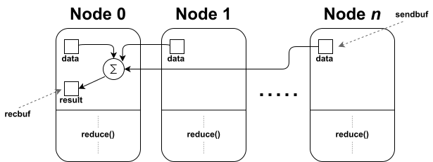

Functions
#########

State functions
===============

.. cpp:function:: i32 __netqir__init(i32 argc, ptr argv)

    Initializes the distributed environment.

    :param i32 argc: Number of arguments.
    :param ptr argv: Arguments.

    :return: 0 if successful, 1 otherwise.

.. cpp:function:: i32 __netqir__finalize(void)

    Finalize the distributed environment.

    :return: 0 if successful, 1 otherwise.

Operate datatypes functions
===========================
Most of these operations are born from MPI directives. They have the same functionalities, but with a quantum
backend behind them. **#TODO**: Add more information about the functions.

``%Comm`` functions
-------------------
The ``%Comm`` datatype is used to define a communicator, which is a group of nodes that can communicate with each other. The communicator is used to define the scope of the communication, and it is used to create a new communicator from a subset of nodes from another communicator, as well as to create a communicator as a copy of another.

The different functions that can be used with the ``%Comm`` datatype are:

.. cpp:function:: i32 __netqir__comm_create(Comm* old_comm, Group* group, Comm** new_comm)

    Creates a new communicator from a subset of nodes from another communicator.

    :param Comm* old_comm: Old communicator from which the new is created.
    :param Group* group: Group of nodes inside the new communicator.
    :param Comm** new_comm: New communicator from group.

    :return: 0 if successful, 1 otherwise.

.. cpp:function:: i32 __netqir__comm_create(Comm* old_comm, Comm** new_comm)

    Creates a new communicator as a copy of another.

    :param Comm* old_comm: Old communicator from which the new is created.
    :param Comm** new_comm: New communicator created.

    :return: 0 if successful, 1 otherwise.

.. cpp:function:: i32 __netqir__comm_get_name(Comm* comm, ptr name, ptr length)

    Returns the name of the communicator and its length.

    :param Comm* comm: Communicator of interest.
    :param ptr name: Name of the communicator.
    :param ptr length: Length of the name.

    :return: 0 if successful, 1 otherwise.

.. cpp:function:: i32 __netqir__comm_rank(Comm* comm, ptr rank)

    Returns the rank of the calling process on the communicator.

    :param Comm* comm: Communicator.
    :param ptr rank: Rank of the process.

    :return: 0 if successful, 1 otherwise.

.. cpp:function:: i32 __netqir__comm_set_name(Comm* comm, ptr name)

    Sets the name of the communicator.

    :param Comm* comm: Communicator.
    :param ptr rank: New name of the communicator.

    :return: 0 if successful, 1 otherwise.

.. cpp:function:: i32 __netqir__comm_size(Comm* comm, ptr size)

    Returns the number of nodes, aka size, in the communicator.

    :param Comm* comm: Communicator.
    :param ptr size: Size of the communicator.

    :return: 0 if successful, 1 otherwise.

.. cpp:function:: i32 __netqir__comm_split(Comm* old_comm, i32 color, i32 key, Comm** new_comm)

    Creates a communicator for each color.

    :param Comm* old_comm: Communicator.
    :param i32 color: Value to assign to communicator. Processes with the same color result into the same communicator.
    :param i32 key: Control of the order in which processes are ranked.
    :param Comm** new_comm: Communicator.

    :return: 0 if successful, 1 otherwise.

``%Group`` functions
--------------------

The ``%Group`` datatype is used to define a set of nodes, thus, the operations that can be performed with this datatype are operations between sets, such as the union or intersection of nodes.

.. cpp:function:: i32 __netqir__comm_create_group(Comm* comm, Group* group, Comm** new_comm)

    Creates a communicator for each color.

    :param Comm* comm: Communicator.
    :param Group* group: Subset of the group of nodes in the ``comm`` communicator.
    :param Comm** new_comm: Communicator.

    :return: 0 if successful, 1 otherwise.

.. cpp:function:: i32 __netqir__comm_group(Comm* comm, Group** group)

    Returns the group associated with the communicator.

    :param Comm* comm: Communicator.
    :param Group* group: Group in the communicator.

    :return: 0 if successful, 1 otherwise.

.. cpp:function:: i32 __netqir__group_difference(Group* group1, Group* group2, Group** new_group)

    Returns a group resulting from the difference of two groups, understanding difference as the mathematical one:
    :math:`A \setminus B = \{x \ | \ x \in A \ \text{and} \ x \notin B\}`.

    :param Group* group1: Fisrt group (representing :math:`A` in the example).
    :param Group* group2: Second group (representing :math:`B` in the example).
    :param Group** new_group: Difference of the first and the second group.

    :return: 0 if successful, 1 otherwise.

.. cpp:function:: i32 __netqir__group_union(Group* group1, Group* group2, Group** new_group)

    Returns a group resulting from the union of two groups, understanding union as the mathematical one:
    :math:`A \cup B = \{x \ | \ x \in A \ \text{or} \ x \in B\}`.

    :param Group* group1: Fisrt group.
    :param Group* group2: Second group.
    :param Group** new_group: Union of the first and the second group.

    :return: 0 if successful, 1 otherwise.

.. cpp:function:: i32 __netqir__group_intersection(Group* group1, Group* group2, Group** new_group)

    Returns a group resulting from the intersection of two groups, understanding intersection as the mathematical one:
    :math:`A \cap B = \{x \ | \ x \in A \ \text{and} \ x \in B\}`.

    :param Group* group1: Fisrt group.
    :param Group* group2: Second group.
    :param Group** new_group: Intersection of the first and the second group.

    :return: 0 if successful, 1 otherwise.

.. cpp:function:: i32 __netqir__group_incl(Group* old_group, i32 rank_num, ptr ranks, Group** new_group)

    Produces a group by reordering an existing group and taking only listed members.

    :param Group* old_group: Old group.
    :param i32 rank_num: Amount of nodes in the new group.
    :param ptr ranks: List of ranks (nodes) to include.
    :param Group** new_group: New group from the listed nodes.

    :return: 0 if successful, 1 otherwise.

.. cpp:function:: i32 __netqir__group_range_incl(Group* old_group, i32 n, ptr ranges, Group** new_group)

    Produces a new group from ranges of ranks in an existing group.

    :param Group* old_group: Old group.
    :param i32 n: Size of the array ranges.
    :param ptr ranges: Array of triples of the form (first rank, last rank, stride) indicating which ranks have
                            have to be included ``old_group``.
    :param Group** new_group: New group from the listed nodes.

    :return: 0 if successful, 1 otherwise.

.. cpp:function:: i32 __netqir__group_rank(Group* group, ptr rank)

    Returns the rank of the calling process in the group.

    :param Group* group: Group of interest.
    :param ptr rank: Rank of the calling process.

    :return: 0 if successful, 1 otherwise.

.. cpp:function:: i32 __netqir__group_size(Group* group, ptr size)

    Returns the number of processes (size) of the group.

    :param Group* group: Group of interest.
    :param ptr size: Size of the group.

    :return: 0 if successful, 1 otherwise.

Cartesian topology functions
----------------------------

.. cpp:function:: i32 __netqir__cart_coords(Comm* comm, i32 rank, i32 maxdims, ptr coords)

    Returns coordinates of a process in a cartesian topology.

    :param Group* group: Group of interest.
    :param i32 rank: Rank of the calling process.
    :param i32 maxdims: Number of dimensions of the cartesian topology.
    :param ptr coords: Coordinates of the process in the cartesian topology.

    :return: 0 if successful, 1 otherwise.

.. cpp:function:: i32 __netqir__cart_create(Comm* old_comm, i32 ndims, ptr dims, ptr periods, i1 reorder, Comm** comm_cart)

    Creates a new communicator applying a cartesian topology to a previously created communicator.

    :param Comm* old_comm: Previously created communicator.
    :param i32 ndims: Number of dimensions of the cartesian topology.
    :param ptr dims: Array of size ``ndims`` with the number of nodes in each dimension.
    :param ptr periods: Array of size ``ndims`` with the periodicity of each dimension.
    :param i1 reorder: Flag to allow the reordering of the ranks.
    :param Comm** comm_cart: New communicator with the cartesian topology.

    :return: 0 if successful, 1 otherwise.

.. cpp:function:: i32 __netqir__cart_get(Comm* comm, i32 ndims, ptr dims, ptr periods, ptr coords)

    Returns the cartesian topology information of a given communicator.

    :param Comm* comm: Communicator of interest.
    :param i32 maxdims: Length of the returned arrays.
    :param ptr dims: Number of nodes in each dimension.
    :param ptr periods: Periodicity of each dimension.
    :param ptr coords: Coordinates of the coordinates process in the cartesian topology.

    :return: 0 if successful, 1 otherwise.

.. cpp:function:: i32 __netqir__cart_shift(Comm* comm, i32 direction, i32 displacement, ptr source, ptr destination)

    Returns the source and destination ranks of the process shifted in a cartesian topology.

    :param Comm* comm: Communicator of interest.
    :param i32 direction: Coordinate dimension that suffers the shift.
    :param i32 displacement: Displacement of the shift, being positive (negative) represents a upwards (downwards) shift.
    :param ptr source: Rank of the source process.
    :param ptr destination: Rank of the destination process.

    :return: 0 if successful, 1 otherwise.

.. cpp:function:: i32 __netqir__cart_sub(Comm* comm, ptr remain_dims, Comm** new_comm)

    Partitions a communicator into subgroups which form lower-dimensional cartesian subgrids.

    :param Comm* comm: Communicator of interest with a cartesian topology.
    :param ptr remain_dims: Array determining if the i\ :sup:`th` dimension is kept in the subgrid or not.
    :param Comm** new_comm: Communicator containing the subgrid that includes the calling process.

    :return: 0 if successful, 1 otherwise.

Communication functions
=======================

Communication functions are intended to exchange quantum information, either of an individual qubit using the ``%Qubit`` datatype or of an array of qubits using ``%Array``. 

Communication can be point-to-point or collective. Communication can be **point-to-point** or **collective**. The first type establishes sender and receiver communication from one compute node to another. Collective communications, on the other hand, allow information to be sent from several nodes to several nodes within the same communicator.

Point-to-point communication
----------------------------

Point-to-point communications involves a transfer of information from one node (sender) to another (receiver). To achieve this goal, it is therefore necessary to have both a sending and a receiving function to establish a correct synchronisation between the distributed devices. 

.. image:: ../images/qsend_receive.svg
    :width: 400px
    :align: center

\

In addition, this functions has different versions in function use one or another technique for the distribution. The distribution techniques that can be chosen are "teledata" and "telegate". 

- **Teledata**: This technique sends the qubit data to the destination rank.

\

- **Telegate**: This technique "expose" the qubit reference to the destination rank.

.. image:: ../images/telegate.svg
    :width: 400px
    :align: center

\

Finally, also include directives to perform and send the result of qubit measurements. These functions indicate that the sender measures one or more qubits and sends the classical (binary) result to the receiver.

.. image:: ../images/measure_send.svg
    :width: 400px
    :align: center

Sending functions
~~~~~~~~~~~~~~~~~

.. cpp:function:: i32 __netqir__qsend_array(Array* array, i32 count, i32 dest, Comm* comm)

    Generic blocking send for an array of qubits. The compiler decides which sending technique is used.
    
    :param %Array* array: Array of qubits.
    :param i32 count: Number of qubits.
    :param i32 dest: Destination rank.
    :param %Comm* comm: Communicator.

    :return: 0 if successful, 1 otherwise.

.. cpp:function:: i32 __netqir__qsend_array_teledata(Array* array, i32 count, i32 dest, Comm* comm)

    Generic blocking send for an array of qubits using the teledata technique.
    
    :param %Array* array: Array of qubits.
    :param i32 count: Number of qubits.
    :param i32 dest: Destination rank.
    :param %Comm* comm: Communicator.

    :return: 0 if successful, 1 otherwise.

.. cpp:function:: i32 __netqir__qsend_array_telegate(Array* array, i32 count, i32 dest, Comm* comm)

    Generic blocking send for an array of qubits using the telegate technique.
    
    :param %Array* array: Array of qubits.
    :param i32 count: Number of qubits.
    :param i32 dest: Destination rank.
    :param %Comm* comm: Communicator.

    :return: 0 if successful, 1 otherwise.

.. cpp:function:: i32 __netqir__qsend(Qubit* qubit, i32 dest, Comm* comm)

    Generic blocking send for a single qubit. The compiler decides which sending technique is used.
    
    :param %Qubit* qubit: Qubit to send.
    :param i32 dest: Destination rank.
    :param %Comm* comm: Communicator.

    :return: 0 if successful, 1 otherwise.

.. cpp:function:: i32 __netqir__qsend_teledata(Qubit* qubit, i32 dest, Comm* comm)

    Generic blocking send for a single qubit using the teledata technique.
    
    :param %Qubit* qubit: Qubit to send.
    :param i32 dest: Destination rank.
    :param %Comm* comm: Communicator.

    :return: 0 if successful, 1 otherwise.

.. cpp:function:: i32 __netqir__qsend_telegate(Qubit* qubit, i32 dest, Comm* comm)

    Generic blocking send for a single qubit using the telegate technique.
    
    :param %Qubit* qubit: Qubit to send.
    :param i32 dest: Destination rank.
    :param %Comm* comm: Communicator.

    :return: 0 if successful, 1 otherwise.

Receive functions
~~~~~~~~~~~~~~~~~

.. cpp:function:: i32 __netqir__qrecv_array(Array** array, i32 count, i32 src, Comm* comm)

    Generic blocking receive for a qubit array. The compiler decides which communication technique is used.
    
    :param %Array** buf: Buffer with enough space to store the expected qubits.
    :param i32 count: Number of qubits expected to be received.
    :param i32 src: Source rank.
    :param %Comm* comm: Communicator.

    :return: 0 if successful, 1 otherwise.

.. cpp:function:: i32 __netqir__qrecv_array_teledata(Array** array, i32 count, i32 src, Comm* comm)

    Generic blocking receive for a qubit array using the teledata technique.
    
    :param %Array** buf: Buffer with enough space to store the expected qubits.
    :param i32 count: Number of qubits expected to be received.
    :param i32 src: Source rank.
    :param %Comm* comm: Communicator.

    :return: 0 if successful, 1 otherwise.

.. cpp:function:: i32 __netqir__qrecv_array_telegate(Array** array, i32 count, i32 src, Comm* comm)

    Generic blocking receive for a qubit array using the telegate technique.
    
    :param %Array** buf: Buffer with enough space to store the expected qubits.
    :param i32 count: Number of qubits expected to be received.
    :param i32 src: Source rank.
    :param %Comm* comm: Communicator.

    :return: 0 if successful, 1 otherwise.

.. cpp:function:: i32 __netqir__qrecv(Qubit** buf, i32 src, Comm* comm)

    Generic blocking receive for a single qubit. The compiler decides which communication technique is used.
    
    :param %Qubit** buf: Buffer with space reserved for storing one qubit.
    :param i32 src: Source rank.
    :param %Comm* comm: Communicator.

    :return: 0 if successful, 1 otherwise.

.. cpp:function:: i32 __netqir__qrecv_teledata(Qubit** buf, i32 src, Comm* comm)

    Generic blocking receive for a single qubit using teledata technique.
    
    :param %Qubit** buf: Buffer with space reserved for storing one qubit.
    :param i32 src: Source rank.
    :param %Comm* comm: Communicator.

    :return: 0 if successful, 1 otherwise.

.. cpp:function:: i32 __netqir__qrecv_telegate(Qubit** buf, i32 src, Comm* comm)

    Generic blocking receive for a single qubit using telegate technique.
    
    :param %Qubit** buf: Buffer with space reserved for storing one qubit.
    :param i32 src: Source rank.
    :param %Comm* comm: Communicator.

    :return: 0 if successful, 1 otherwise.

Measurement functions
~~~~~~~~~~~~~~~~~~~~~

.. cpp:function:: i32 __netqir__measure_send_array(Array* array, i32 count, i32 dest, Comm* comm)

    Measure a array of qubits and send the classical results (binary) to the destination rank.
    
    :param %Array* array: Array of qubits to measure.
    :param i32 count: Number of qubits in the array.
    :param i32 dest: Destination rank of the binary result.
    :param %Comm* comm: Communicator.

    :return: 0 if successful, 1 otherwise.

.. cpp:function:: i32 __netqir__measure_send(Qubit* qubit, i32 dest, Comm* comm)

    Measure a single qubit and send the classical result (binary) to the destination rank.
    
    :param %Qubit* qubit: Qubit to measure.
    :param i32 dest: Destination rank of the binary result.
    :param %Comm* comm: Communicator.

    :return: 0 if successful, 1 otherwise.

.. cpp:function:: i32 __netqir__measure_recv_array(i1* buf, i32 count, i32 src, Comm* comm)

    Receive the classical results of a remote qubit array measurement.
    
    :param i1* buf: Buffer with enough space to store the expected binary results.
    :param i32 count: Number of qubits measured.
    :param i32 src: Source rank of the binary results.
    :param %Comm* comm: Communicator.

    :return: 0 if successful, 1 otherwise.

.. cpp:function:: i32 __netqir__measure_recv(i1* buf, i32 src, Comm* comm)
    
    Receive the classical result of a remote qubit measurement.
    
    :param i1* buf: Buffer with enough space to store the expected binary result.
    :param i32 src: Source rank of the binary result.
    :param %Comm* comm: Communicator.

    :return: 0 if successful, 1 otherwise.
    
Collective communication
------------------------

Collective communications are used to exchange information between several nodes. The most common collective communication functions, in the classical computing, are ``broadcast``, ``scatter``, ``gather``, and ``reduce``.

In quantum computing, a broadcast function cannot be implemented due to the no-cloning theorem, but an alternative is proposed through a function called ``expose``. This function allows a qubit to be shared among all nodes in the communicator.

Scatter
~~~~~~~

The scatter function distributes the elements of a qubit array among the nodes in the communicator. The array is divided into equal parts and each part is sent to a different node.

.. image:: ../images/scatter.svg
    :width: 600px
    :align: center

\

.. cpp:function:: i32 __netqir__scatter(Array* sendbuf, i32 sendcount, Array* recvbuf, i32 recvcount, i32 root, Comm* comm)

    Scatter an array of qubits from the root node to all nodes in the communicator. The compiler decides which sending technique is used.
    
    :param %Array* sendbuf: Array of qubits to send (only for the sender).
    :param i32 sendcount: Number of qubits to send (only for the sender).
    :param %Array* recvbuf: Buffer with enough space to store the received qubits.
    :param i32 recvcount: Number of qubits to receive.
    :param i32 root: Rank of the root node (sender).
    :param %Comm* comm: Communicator.

    :return: 0 if successful, 1 otherwise.

.. cpp:function:: i32 __netqir__scatter_teledata(Array* sendbuf, i32 sendcount, Array* recvbuf, i32 recvcount, i32 root, Comm* comm)
    
        Scatter an array of qubits from the root node to all nodes in the communicator using the teledata technique.
        
        :param %Array* sendbuf: Array of qubits to send (only for the sender).
        :param i32 sendcount: Number of qubits to send (only for the sender).
        :param %Array* recvbuf: Buffer with enough space to store the received qubits.
        :param i32 recvcount: Number of qubits to receive.
        :param i32 root: Rank of the root node (sender).
        :param %Comm* comm: Communicator.
    
        :return: 0 if successful, 1 otherwise.

.. cpp:function:: i32 __netqir__scatter_telegate(Array* sendbuf, i32 sendcount, Array* recvbuf, i32 recvcount, i32 root, Comm* comm)
        
        Scatter an array of qubits from the root node to all nodes in the communicator using the telegate technique.
        
        :param %Array* sendbuf: Array of qubits to send (only for the sender).
        :param i32 sendcount: Number of qubits to send (only for the sender).
        :param %Array* recvbuf: Buffer with enough space to store the received qubits.
        :param i32 recvcount: Number of qubits to receive.
        :param i32 root: Rank of the root node (sender).
        :param %Comm* comm: Communicator.
    
        :return: 0 if successful, 1 otherwise.

Gather
~~~~~~~

The gather function collects the elements of a qubit array from all nodes in the communicator. The elements are received and stored in a single node.

.. image:: ../images/gather.svg
    :width: 600px
    :align: center

\

.. cpp:function:: i32 __netqir__gather(Array* sendbuf, i32 sendcount, Array* recvbuf, i32 recvcount, i32 root, Comm* comm)

    Gather an array of qubits from all nodes in the communicator to the root node. The compiler decides which sending technique is used.
    
    :param %Array* sendbuf: Array of qubits to send.
    :param i32 sendcount: Number of qubits to send.
    :param %Array* recvbuf: Buffer with enough space to store the received qubits (only for the root).
    :param i32 recvcount: Number of qubits to receive (only for the root).
    :param i32 root: Rank of the root node (receiver).
    :param %Comm* comm: Communicator.

    :return: 0 if successful, 1 otherwise.

.. cpp:function:: i32 __netqir__gather_teledata(Array* sendbuf, i32 sendcount, Array* recvbuf, i32 recvcount, i32 root, Comm* comm)

    Gather an array of qubits from all nodes in the communicator to the root node using the teledata technique.
    
    :param %Array* sendbuf: Array of qubits to send.
    :param i32 sendcount: Number of qubits to send.
    :param %Array* recvbuf: Buffer with enough space to store the received qubits (only for the root).
    :param i32 recvcount: Number of qubits to receive (only for the root).
    :param i32 root: Rank of the root node (receiver).
    :param %Comm* comm: Communicator.

    :return: 0 if successful, 1 otherwise.

.. cpp:function:: i32 __netqir__gather_telegate(Array* sendbuf, i32 sendcount, Array* recvbuf, i32 recvcount, i32 root, Comm* comm)
    
    Gather an array of qubits from all nodes in the communicator to the root node using the telegate technique.
    
    :param %Array* sendbuf: Array of qubits to send.
    :param i32 sendcount: Number of qubits to send.
    :param %Array* recvbuf: Buffer with enough space to store the received qubits (only for the root).
    :param i32 recvcount: Number of qubits to receive (only for the root).
    :param i32 root: Rank of the root node (receiver).
    :param %Comm* comm: Communicator.

    :return: 0 if successful, 1 otherwise.

Expose
~~~~~~~

The expose function allows a qubit to be shared among all nodes in the communicator. The qubit is shared by exposing its reference (not copy) to all nodes.

.. image:: ../images/expose.svg
    :width: 400px
    :align: center

\

.. cpp:function:: i32 __netqir__expose(Qubit* qubit, i32 root, Comm* comm)

    Expose a qubit to all nodes in the communicator.
    
    :param %Qubit* qubit: Qubit to expose.
    :param i32 root: Rank of the root node.
    :param %Comm* comm: Communicator.

    :return: 0 if successful, 1 otherwise.

.. cpp:function:: i32 __netqir__expose_array(Array* array, i32 count, i32 root, Comm* comm)

    Expose an array of qubits to all nodes in the communicator.
    
    :param %Array* array: Array of qubits to expose.
    :param i32 count: Number of qubits in the array.
    :param i32 root: Rank of the root node.
    :param %Comm* comm: Communicator.

    :return: 0 if successful, 1 otherwise.

Reduce
~~~~~~

\

The reduce function aggregates the elements of a qubit array from all nodes in the communicator. The elements are combined using an operation and the result is stored in a single node.

\
\

.. cpp:function:: i32 __netqir__reduce(Array* sendbuf, i32 sendcount, Array *recvbuf, i32 operation, i32 root, Comm* comm)

    Reduce an array of qubits from all nodes in the communicator to the root node. The compiler decides which sending technique is used.
    
    :param %Array* sendbuf: Array of qubits to send.
    :param i32 sendcount: Number of qubits to send.
    :param %Array* recvbuf: Buffer with enough space to store the received qubits (only for the root).
    :param i32 operation: Operation to perform.
    :param i32 root: Rank of the root node (receiver).
    :param %Comm* comm: Communicator.

    :return: 0 if successful, 1 otherwise.

.. cpp:function:: i32 __netqir__reduce_teledata(Array* sendbuf, i32 sendcount, Array *recvbuf, i32 operation, i32 root, Comm* comm)
    
    Reduce an array of qubits from all nodes in the communicator to the root node using the teledata technique.
    
    :param %Array* sendbuf: Array of qubits to send.
    :param i32 sendcount: Number of qubits to send.
    :param %Array* recvbuf: Buffer with enough space to store the received qubits (only for the root).
    :param i32 operation: Operation to perform.
    :param i32 root: Rank of the root node (receiver).
    :param %Comm* comm: Communicator.

    :return: 0 if successful, 1 otherwise.

.. cpp:function:: i32 __netqir__reduce_telegate(Array* sendbuf, i32 sendcount, Array *recvbuf, i32 operation, i32 root, Comm* comm)
        
    Reduce an array of qubits from all nodes in the communicator to the root node using the telegate technique.
    
    :param %Array* sendbuf: Array of qubits to send.
    :param i32 sendcount: Number of qubits to send.
    :param %Array* recvbuf: Buffer with enough space to store the received qubits (only for the root).
    :param i32 operation: Operation to perform.
    :param i32 root: Rank of the root node (receiver).
    :param %Comm* comm: Communicator.

    :return: 0 if successful, 1 otherwise.  