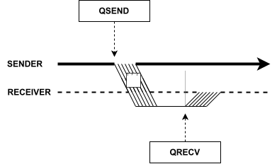

Functions
=========

State functions
---------------

.. cpp:function:: i32 __netqir__init(i32 argc, i8** argv)

    Initializes the distributed environment.

    :param i32 argc: Number of arguments.
    :param i8** argv: Arguments.

    :return: 0 if successful, 1 otherwise.

.. cpp:function:: i32 __netqir__finalize(void)

    Finalize the distributed environment.

    :return: 0 if successful, 1 otherwise.

Operate datatypes functions
---------------------------

Communication functions
-----------------------
Communication functions are intended to exchange quantum information, either of an individual qubit using the ``%Qubit`` datatype or of an array of qubits using ``%Array``. To achieve this goal, it is therefore necessary to have both a sending and a receiving function to establish a correct synchronisation between the distributed devices. 

\

In addition, this functions has different versions in function use one or another technique for the distribution. The distribution techniques that can be chosen are "teledata" and "telegate". 

- **Teledata**: This technique sends the qubit data to the destination rank.

..  image:: ../images/teledata.svg
    :width: 400px
    :align: center

\

- **Telegate**: This technique "expose" the qubit reference to the destination rank.

\

Finally, also include directives to perform and send the result of qubit measurements. These functions indicate that the sender measures one or more qubits and sends the classical (binary) result to the receiver.

Sending functions
~~~~~~~~~~~~~~~~~

.. cpp:function:: i32 __netqir__qsend_array(Array* array, i32 count, i32 dest, Comm* comm)

    Generic blocking send for an array of qubits. The compiler decides which sending technique is used.
    
    :param %Array* array: Array of qubits.
    :param i32 count: Number of qubits.
    :param i32 dest: Destination rank.
    :param %Comm comm: Communicator.

    :return: 0 if successful, 1 otherwise.

.. cpp:function:: i32 __netqir__qsend_array_teledata(Array* array, i32 count, i32 dest, Comm* comm)

    Generic blocking send for an array of qubits using the teledata technique.
    
    :param %Array* array: Array of qubits.
    :param i32 count: Number of qubits.
    :param i32 dest: Destination rank.
    :param %Comm comm: Communicator.

    :return: 0 if successful, 1 otherwise.

.. cpp:function:: i32 __netqir__qsend_array_telegate(Array* array, i32 count, i32 dest, Comm* comm)

    Generic blocking send for an array of qubits using the telegate technique.
    
    :param %Array* array: Array of qubits.
    :param i32 count: Number of qubits.
    :param i32 dest: Destination rank.
    :param %Comm comm: Communicator.

    :return: 0 if successful, 1 otherwise.

.. cpp:function:: i32 __netqir__qsend(Qubit* qubit, i32 dest, Comm* comm)

    Generic blocking send for a single qubit. The compiler decides which sending technique is used.
    
    :param %Qubit* qubit: Qubit to send.
    :param i32 dest: Destination rank.
    :param %Comm comm: Communicator.

    :return: 0 if successful, 1 otherwise.

.. cpp:function:: i32 __netqir__qsend_teledata(Qubit* qubit, i32 dest, Comm* comm)

    Generic blocking send for a single qubit using the teledata technique.
    
    :param %Qubit* qubit: Qubit to send.
    :param i32 dest: Destination rank.
    :param %Comm comm: Communicator.

    :return: 0 if successful, 1 otherwise.

.. cpp:function:: i32 __netqir__qsend_telegate(Qubit* qubit, i32 dest, Comm* comm)

    Generic blocking send for a single qubit using the telegate technique.
    
    :param %Qubit* qubit: Qubit to send.
    :param i32 dest: Destination rank.
    :param %Comm comm: Communicator.

    :return: 0 if successful, 1 otherwise.

Receive functions
~~~~~~~~~~~~~~~~~

.. cpp:function:: i32 __netqir__qrecv_array(Array** array, i32 count, i32 src, Comm* comm)

    Generic blocking receive for a qubit array. The compiler decides which communication technique is used.
    
    :param %Array** buf: Buffer with enough space to store the expected qubits.
    :param i32 count: Number of qubits expected to be received.
    :param i32 src: Source rank.
    :param %Comm comm: Communicator.

    :return: 0 if successful, 1 otherwise.

.. cpp:function:: i32 __netqir__qrecv_array_teledata(Array** array, i32 count, i32 src, Comm* comm)

    Generic blocking receive for a qubit array using the teledata technique.
    
    :param %Array** buf: Buffer with enough space to store the expected qubits.
    :param i32 count: Number of qubits expected to be received.
    :param i32 src: Source rank.
    :param %Comm comm: Communicator.

    :return: 0 if successful, 1 otherwise.

.. cpp:function:: i32 __netqir__qrecv_array_telegate(Array** array, i32 count, i32 src, Comm* comm)

    Generic blocking receive for a qubit array using the telegate technique.
    
    :param %Array** buf: Buffer with enough space to store the expected qubits.
    :param i32 count: Number of qubits expected to be received.
    :param i32 src: Source rank.
    :param %Comm comm: Communicator.

    :return: 0 if successful, 1 otherwise.

.. cpp:function:: i32 __netqir__qrecv(Qubit** buf, i32 src, Comm* comm)

    Generic blocking receive for a single qubit. The compiler decides which communication technique is used.
    
    :param %Qubit** buf: Buffer with space reserved for storing one qubit.
    :param i32 src: Source rank.
    :param %Comm comm: Communicator.

    :return: 0 if successful, 1 otherwise.

.. cpp:function:: i32 __netqir__qrecv_teledata(Qubit** buf, i32 src, Comm* comm)

    Generic blocking receive for a single qubit using teledata technique.
    
    :param %Qubit** buf: Buffer with space reserved for storing one qubit.
    :param i32 src: Source rank.
    :param %Comm comm: Communicator.

    :return: 0 if successful, 1 otherwise.

.. cpp:function:: i32 __netqir__qrecv_telegate(Qubit** buf, i32 src, Comm* comm)

    Generic blocking receive for a single qubit using telegate technique.
    
    :param %Qubit** buf: Buffer with space reserved for storing one qubit.
    :param i32 src: Source rank.
    :param %Comm comm: Communicator.

    :return: 0 if successful, 1 otherwise.

Measurement functions
~~~~~~~~~~~~~~~~~~~~~

.. cpp:function:: i32 __netqir__measure_send_array(Array* array, i32 count, i32 dest, Comm* comm)

    Measure a array of qubits and send the classical results (binary) to the destination rank.
    
    :param %Array* array: Array of qubits to measure.
    :param i32 count: Number of qubits in the array.
    :param i32 dest: Destination rank of the binary result.
    :param %Comm comm: Communicator.

    :return: 0 if successful, 1 otherwise.

.. cpp:function:: i32 __netqir__measure_send(Qubit* qubit, i32 dest, Comm* comm)

    Measure a single qubit and send the classical result (binary) to the destination rank.
    
    :param %Qubit* qubit: Qubit to measure.
    :param i32 dest: Destination rank of the binary result.
    :param %Comm comm: Communicator.

    :return: 0 if successful, 1 otherwise.

.. cpp:function:: i32 __netqir__measure_recv_array(i1* buf, i32 count, i32 src, Comm* comm)

    Receive the classical results of a remote qubit array measurement.
    
    :param i1* buf: Buffer with enough space to store the expected binary results.
    :param i32 count: Number of qubits measured.
    :param i32 src: Source rank of the binary results.
    :param %Comm comm: Communicator.

    :return: 0 if successful, 1 otherwise.

.. cpp:function:: i32 __netqir__measure_recv(i1* buf, i32 src, Comm* comm)
    
    Receive the classical result of a remote qubit measurement.
    
    :param i1* buf: Buffer with enough space to store the expected binary result.
    :param i32 src: Source rank of the binary result.
    :param %Comm comm: Communicator.

    :return: 0 if successful, 1 otherwise.
    